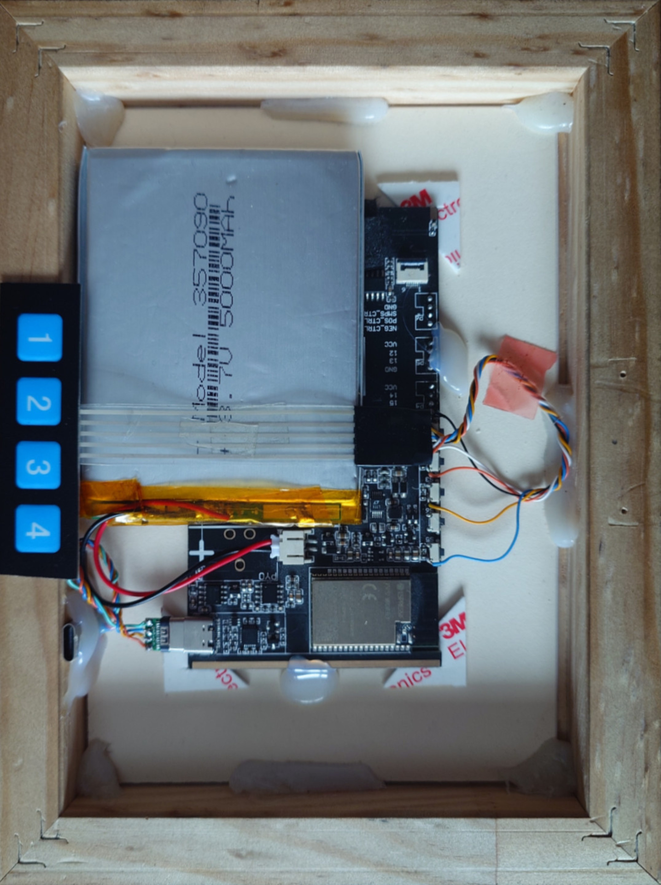
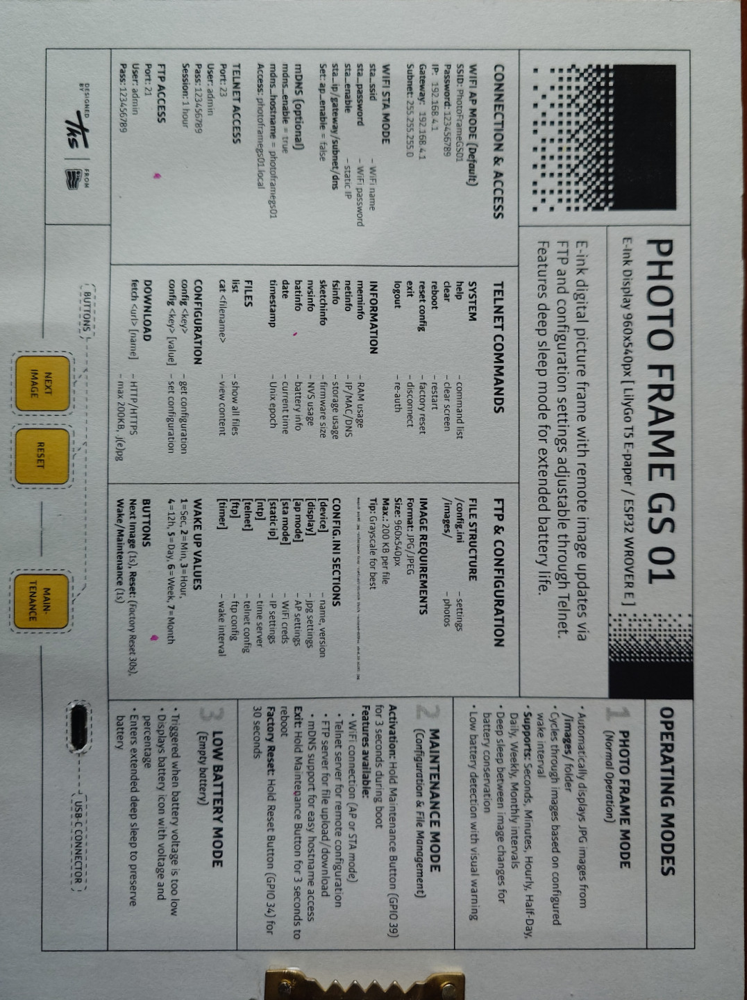
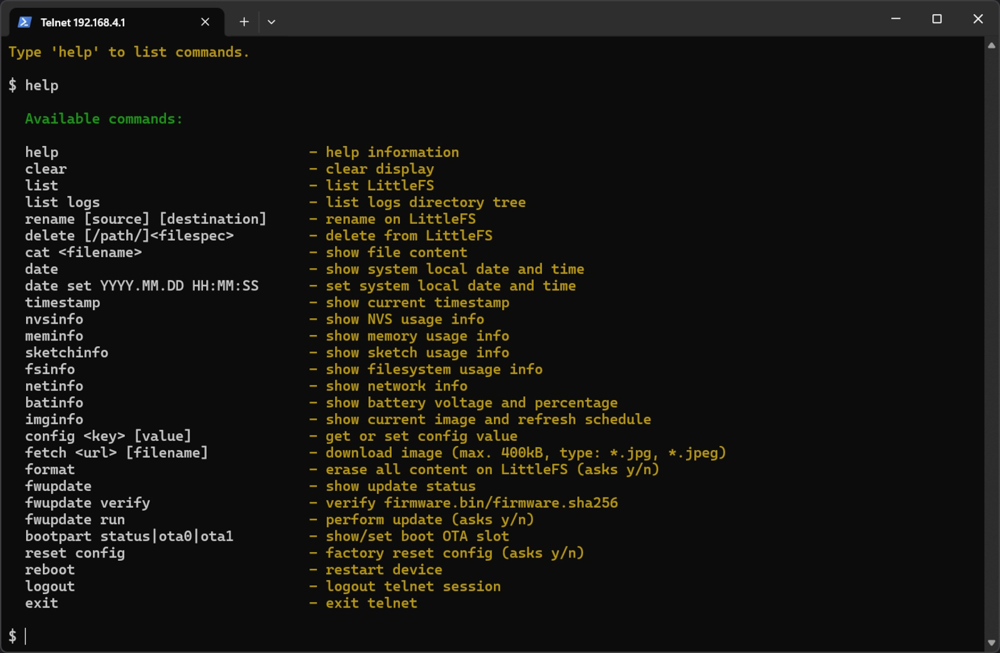
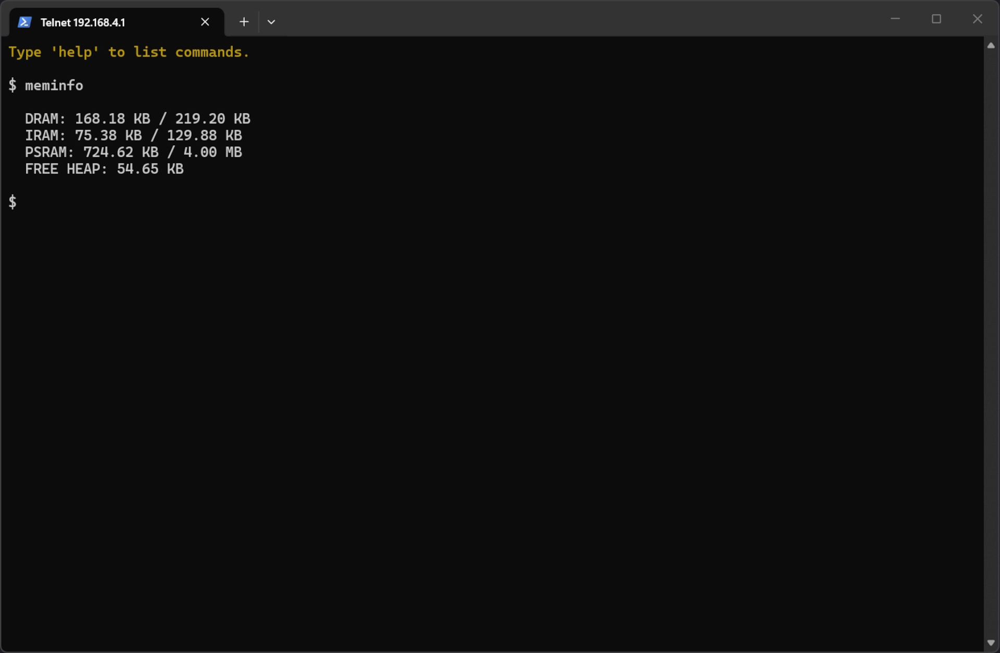
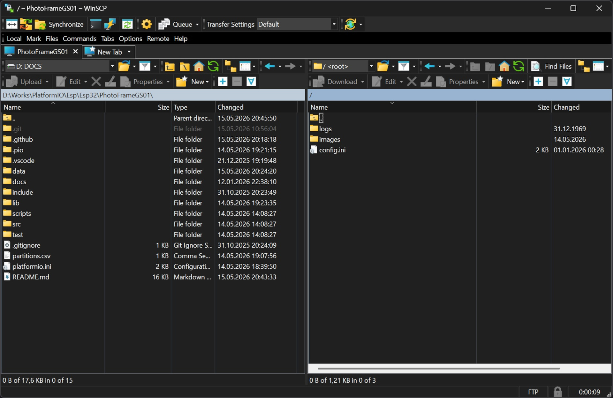

# Photo Frame GS01 — [ Grayscale E-Ink ]

Grayscale e-ink digital photo frame with autonomous slideshow operation, deep sleep scheduling, and remote maintenance through Telnet and FTP.

> **📌 Note:** This project targets the **LilyGo T5 4.7 inch E-Paper** (ESP32-WROVER-E) and is **Telnet + FTP** based. For the newer **LilyGo T5 4.7 inch E-Paper Plus** (ESP32-S3) variant, see [PhotoFrameGS02](https://github.com/tokosattila/PhotoFrameGS02.git) (**Telnet + FTP** based). For the color variant based on the **Waveshare ESP32-S3-PhotoPainter 7.3 inch E6**, see [PhotoFrameCL01](https://github.com/tokosattila/PhotoFrameCL01.git) (**web admin** based).

The project is designed around three goals:
1. Low-power autonomous image display with deep sleep.
2. Reliable maintenance workflows through Telnet and FTP.
3. Robust field operation with NVS-backed configuration and dual OTA partitions.

## 1. Photo

|  |  |  |
|:---:|:---:|:---:|
| *Photo frame with image* | *Hardware back side* | *Back cover installed* |

|  |  |  |
|:---:|:---:|:---:|
| *Telnet Help Command* | *Telnet MemInfo Command* | *FTP* |

## 2. Hardware

<table width="100%">
<tr>
<td align="center" style="padding:10px!important">

| Component | Specification |
|-----------|--------------|
| **Board** | LilyGo T5 4.7 inch E-Paper |
| **MCU** | ESP32-WROVER-E |
| **Display** | 4.7 inch ED047TC1, 16-level grayscale e-paper, 960x540px |
| **Flash** | 16MB |
| **PSRAM** | 4MB |
| **Storage** | LittleFS |
| **Battery** | Li-Ion 18650 (optional) |

</td>
<td align="center">

</td>
</tr>
</table>

## 3. System Architecture

The runtime is organized into focused modules under `src/App`:

- `Configuration_`: NVS persistence, INI roundtrip, and defaults.
- `LittleFs_`: LittleFS file operations and media/log access.
- `Display_`: grayscale rendering pipeline, JPEG tuning, and drawing primitives.
- `Connection_`: AP/STA networking and optional mDNS.
- `Firmware_`: OTA verification and partition switching.
- `NTP_`: time synchronization services.
- `FTP_`: remote file transfer and media management.
- `Telnet_`: authenticated command console with lockout policy.
- `LogManager_`: file-based event logger with per-level structured output, daily file rotation, and runtime enable/disable control via NVS config.
- `Button_`: button logic.
- `Tone_`: piezo tone signaling with reusable tone patterns.
- `Utils_`: sleep/wakeup logic, CPU frequency switching, diagnostics.

The application entrypoint in `src/Main.cpp` orchestrates initialization and mode routing.

## 4. Boot Sequence and Operating Modes

### 4.1 Boot Sequence

Startup flow (high level):

1. Initialize config from NVS and load defaults on first boot.
2. Initialize utility/peripheral stack.
3. Validate wake source in production deep-sleep boot paths.
4. Check battery state.
5. Route to maintenance or photo-frame mode based on wake and button logic.

### 4.2 Photo Frame Mode

Purpose: autonomous slideshow operation with minimal power draw.

Core behavior:

- Mount storage.
- Initialize `LogManager_` and write boot and battery events.
- Resolve current image from persisted config.
- Render JPEG with active grayscale tuning.
- Persist next image pointer.
- Log halt state and enter deep sleep.

If the current image is missing or unreadable, a built-in fallback image is shown.

### 4.3 Maintenance Mode

Purpose: online maintenance via Telnet and FTP.

Core behavior:

- Bring up WiFi according to AP/STA configuration.
- Start Telnet and/or FTP services.
- Play maintenance entry tone sequence on mode start.
- Display connection hints on e-ink screen.
- Support remote config, file, and firmware operations.
- Track activity and enforce inactivity timeout for safe auto-exit.

### 4.4 Low Battery Mode

Purpose: protect battery and avoid unstable operation.

Core behavior:

- Show low-battery warning screen.
- Play low-battery warning tone sequence.
- Power down non-essential peripherals.
- Enter low-power sleep path.

## 5. Configuration

Configuration is NVS-backed and synchronized with `config.ini`.

On first boot, defaults are created and persisted by the configuration subsystem.

Configuration domains include:

- Device identity and version fields.
- Display tuning (`jpg_brightness`, `jpg_contrast`, `jpg_gamma`) and active image pointer.
- WiFi AP/STA profiles and optional static IP.
- mDNS hostname settings.
- NTP and wake scheduling.
- Telnet/FTP service enable flags, credentials, and session timing.
- Storage default selection and fallback behavior.
- LogManager runtime enable flag (`log_enabled`).
- Tone signaling enable/disable via NVS config (`ton.en`) and `config.ini` ([tone] section).

Factory reset clears persisted configuration and restarts the device.

### 5.1 `config.ini` Example

Place `config.ini` in LittleFS root (`/config.ini`):

```ini
[device]
appname = PHOTO FRAME GS01
version = v1.0

[display]
jpg_brightness = 0
jpg_contrast = 100
jpg_gamma = 100
image_file = pic01.jpg

[ntp]
ntp_server = pool.ntp.org
ntp_port = 123
ntp_gmt_offset = 7200
ntp_daylight_offset = 3600
ntp_timezone_label = EET
ntp_low_power_sync_enable = true
ntp_low_power_sync_interval = 604800

[ap mode]
ap_enable = true
ap_ssid = PhotoFrameGS01
ap_password = 123456789
ap_ip = 192.168.4.1
ap_gateway = 192.168.4.1
ap_subnet = 255.255.255.0
fallback_ap_ssid = PhotoFrameGS01-Fallback
fallback_ap_password = 123456789
fallback_ap_ip = 192.168.5.1
fallback_ap_gateway = 192.168.5.1
fallback_ap_subnet = 255.255.255.0

[sta mode]
sta_ssid = YourNetwork
sta_password = YourPassword
sta_auto_fallback = true

[static ip]
sta_enable = false
sta_ip = 192.168.0.83
sta_gateway = 192.168.0.1
sta_subnet = 255.255.255.0
sta_dns1 = 192.168.0.1
sta_dns2 = 8.8.8.8

[mdns]
mdns_enable = false
mdns_hostname = photoframegs01

[timer]
wake_up = 4
wake_up_hour = 6

[telnet]
telnet_enable = true
telnet_port = 23
telnet_username = admin
telnet_password = 123456789
telnet_session = 3600000

[ftp]
ftp_enable = true
ftp_port = 21
ftp_username = admin
ftp_password = 123456789

[tone]
tone_enable = true

[storage]
fallback_enabled = true
```

`image_updated_at` is internal metadata stored in NVS (`dsp.file.upd`), intentionally excluded from `config.ini` and from the `config` command.

### 5.2 NTP Automatic Synchronization

NTP automatic time synchronization can be controlled with `ntp_low_power_sync_enable` (boolean, default: `true`) and `ntp_low_power_sync_interval` (seconds, default: 604800 = 1 week).

- `ntp_low_power_sync_enable = true`: Enable periodic NTP sync in maintenance mode or during active WiFi sessions.
- `ntp_low_power_sync_interval = 604800`: Sync interval in seconds (e.g., 86400 = daily, 604800 = weekly, 2592000 = monthly).

Manual time adjustment is available via Telnet with `date set YYYY.MM.DD HH:MM:SS`.

## 6. Power, Sleep, and Wake Mechanisms

### 6.1 Wake Scheduling

Timer modes are enum-based and support:

- Minutes
- Hourly
- Half-day
- Daily
- Weekly
- Monthly

For Daily/Weekly/Monthly, `wake_up_hour` (0-23) is respected; shorter interval modes ignore hour targeting.

### 6.2 Deep Sleep Strategy

Photo Frame mode calculates sleep target and enters deep sleep after render completion.

Wake sources include timer and button-triggered wake logic.

### 6.3 Battery and Safe Fallback

If low battery is detected, firmware switches to protective flow:

- warning screen,
- reduced activity,
- low-power sleep path.

## 7. Session and Security Model

Maintenance access is centered around Telnet authentication plus network reachability.

Security behavior:

- Username/password login is required for Telnet commands.
- Session timeout is controlled by `telnet_session`.
- Failed login attempts trigger progressive lockout.

Lockout levels:

- After 3 failed attempts: 30 seconds.
- Next level: 1 hour.
- Next level: 1 day.
- Successful login resets lockout state.

## 8. Maintenance Inactivity Mechanism

Maintenance loop tracks Telnet and FTP activity.

When inactivity reaches `MAINTENANCE_INACTIVITY_TIMEOUT_MS` (currently 5 minutes), firmware restarts and returns to normal boot path.

This avoids leaving the device permanently in maintenance mode.

## 9. Storage and Media Pipeline

`LittleFs_` provides file operations for images, logs, and firmware assets on LittleFS.

Behavior:

- Use LittleFS as the media/config/log storage backend.
- Keep image directory operations consistent for slideshow and maintenance commands.
- Provide list/read/write/delete/rename flows used by Telnet and FTP.

## 10. Display Rendering Pipeline

`Display_` wraps grayscale e-paper drawing and rendering policies.

Main responsibilities:

- JPEG decode and render for 16-level grayscale panel output.
- Apply brightness, contrast, and gamma tuning.
- Draw text/status screens.
- Control update and power-off sequence for e-paper lifecycle.

Known limitation:

- Runtime image rotation is not available in current driver stack.
- Images must be prepared in portrait orientation before upload.

## 11. Networking and Time Services

### 11.1 Connectivity

`Connection_` supports AP and STA operation with optional static IP.

Capabilities:

- AP mode for local maintenance access.
- STA mode for network-integrated usage.
- Optional mDNS hostname publishing (`hostname.local`).

### 11.2 Time Management

`NTP_` keeps system time synchronized when network is available.

- NTP sync updates system clock.
- Wake scheduling uses system time calculations.

## 12. Firmware Update (OTA) and Partitioning

Partition design (`partitions.csv`):

- `ota_0` and `ota_1` app slots.
- `otadata` active boot metadata.
- `littlefs` data partition.
- `nvs` configuration partition.

OTA workflow:

1. Upload `firmware.bin` and `firmware.sha256` to `/firmware/`.
2. Run `fwupdate verify`.
3. Run `fwupdate run`.
4. Reboot into selected target slot.

Boot slot controls:

- `bootpart status`
- `bootpart ota0`
- `bootpart ota1`

USB upload note:

- Plain USB upload usually writes firmware to `0x10000` (typically `ota_0`).
- If the device boots from the other slot, set target explicitly with `bootpart ota0` or `bootpart ota1`, then reboot.

## 13. Telnet and FTP Maintenance Interface

### 13.1 Telnet Command Set

| Command | Description |
|---------|-------------|
| `help` | Help information |
| `clear` | Clear display |
| `list` | List LittleFS |
| `list logs` | List logs directory tree |
| `rename [source] [destination]` | Rename on LittleFS |
| `delete [/path/]<filespec>` | Delete from LittleFS |
| `cat <filename>` | Show file content |
| `date` | Show system local date and time |
| `date set YYYY.MM.DD HH:MM:SS` | Set system local date and time |
| `timestamp` | Show current timestamp |
| `nvsinfo` | Show NVS usage info |
| `meminfo` | Show memory usage info |
| `sketchinfo` | Show sketch usage info |
| `fsinfo` | Show filesystem usage info |
| `netinfo` | Show network info |
| `batinfo` | Show battery voltage and percentage |
| `imginfo` | Show current image and refresh schedule |
| `config <key> [value]` | Get or set config value |
| `fetch <url> [filename]` | Download image (max. 400kB, type: *.jpg, *.jpeg) |
| `format` | Erase all content on LittleFS (asks y/n) |
| `fwupdate` | Show update status |
| `fwupdate verify` | Verify firmware.bin/firmware.sha256 |
| `fwupdate run` | Perform update (asks y/n) |
| `bootpart status\|ota0\|ota1` | Show/set boot OTA slot |
| `reset config` | Factory reset config (asks y/n) |
| `reboot` | Restart device |
| `logout` | Logout Telnet session |
| `exit` | Exit telnet |

### 13.2 File Operation Syntax

| Syntax | Example | Description |
|--------|---------|-------------|
| List files | `list` | Lists content of LittleFS |
| List logs | `list logs` | Lists logs directory tree |
| Rename file | `rename old.jpg new.jpg` | Renames on LittleFS |
| Delete by path/pattern | `delete /images/*.jpg` | Deletes matching files from LittleFS |

Notes:

- `delete` requires `y/n` confirmation.
- `format` requires `y/n` confirmation.
- `rename` operates on LittleFS; destination must not already exist.

### 13.3 FTP Scope

FTP is intended for bulk media and firmware file transfer.

Typical usage:

- Upload images to storage.
- Upload OTA artifacts to `/firmware/`.
- Verify remote file state before running maintenance commands.

## 14. Logging (Detailed)

Log files are written in date-based hierarchy with rollover:

- `logs/YYYY/MM/DD/YYYYMMDD.log`
- rollover on same day: `YYYYMMDD_1.log`, `YYYYMMDD_2.log`, ...
- rollover threshold: 512 KB per file

Runtime behavior:

- Enabled/disabled by NVS-backed config (`log_enabled`).
- Initialized after storage mount.
- Tracks boot/halt and subsystem events.
- Log files are managed by firmware components; no dedicated `log` Telnet command is currently registered.

## 15. Build and Deployment

Project uses PlatformIO (`platformio.ini`) with `photo_frame_gs_01` environment.

Requirements:

- [PlatformIO](https://platformio.org/)
- `arduino-esp32 >= 2.0.3`

Typical commands:

```bash
pio run -e photo_frame_gs_01
pio run -e photo_frame_gs_01 -t upload
pio run -e photo_frame_gs_01 -t uploadfs
pio test -e native
pio device monitor
```

## 16. Tooling and Utility Scripts

`scripts/` contains support tools for default content, assets, and firmware helper workflows:

- `default.h` / `default.png`: bundled fallback visual asset source.
- `imgconvert.py`: image conversion/preparation helper.
- `imgprepare/imgprepare.py`: converts JPG/PNG/WEBP to e-paper-ready grayscale JPG (8-bit default to preserve detail; optional `--quantize-16` for pre-quantized output).
- `imgprepare/input/`: default source folder for batch conversion inputs.
- `imgprepare/output/`: default target folder for converted outputs.
- `fontconvert.py`: font conversion helper.
- `firmware_sha.py`: firmware hash helper used by OTA packaging.

## 17. Dependencies

- [LilyGoEPD47](https://github.com/Xinyuan-LilyGO/LilyGo-EPD47)
- [JPEGDEC](https://github.com/bitbank2/JPEGDEC)
- [SimpleFTPServer](https://github.com/xreef/SimpleFTPServer)
- [ArduinoHttpClient](https://github.com/arduino-libraries/ArduinoHttpClient)
- [Unity](https://github.com/ThrowTheSwitch/Unity)

## 18. Pin Configuration

| Pin | Function | Description |
|-----|----------|-------------|
| GPIO39 | Button 1 | Wake from deep sleep, enter maintenance mode |
| GPIO34 | Button 2 | Factory reset (hold 30 sec) |
| GPIO12 | Piezo Tone | Tone signaling output (Tone_) |
| GPIO36 | Battery ADC | Battery voltage measurement |

Tone pattern files:

- `src/App/Tone/MaintenanceTone.h`
- `src/App/Tone/LowBatteryTone.h`

## License

MIT License

Copyright (c) 2024-2026 Szeklerman
